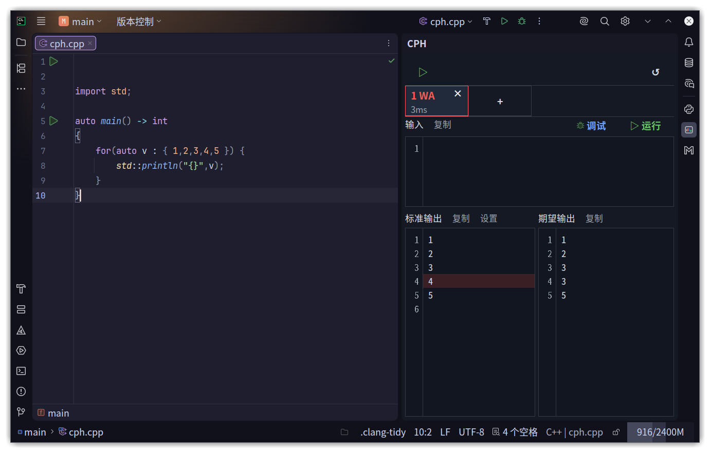
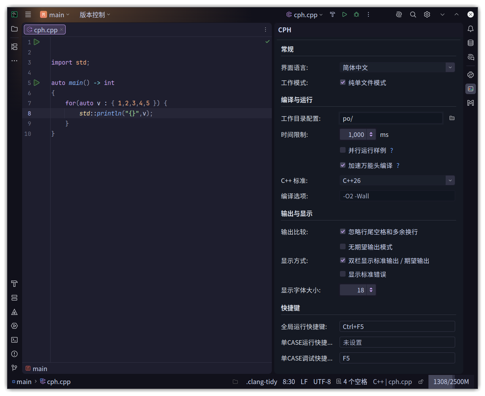

# CPH Target Runner

CPH Target Runner 是一个面向 CLion 的竞赛样例管理插件。它把样例输入、期望输出、运行结果、差异对比、编译选项和快捷键集中到右侧 `CPH` 工具窗口，让你在 CLion 里完成接近 VS Code CPH 的刷题调试流程。

主要功能：

- 按当前 CMake Target 或单个 cpp 文件保存独立样例。
- 支持添加多个 Case、临时禁用 Case、运行单个样例或一键运行全部样例。
- 自动对比标准输出和期望输出，高亮定位 WA 差异。
- 支持纯单文件模式，适合日常竞赛刷题，不需要手动维护多个 CMake Target。
- 支持配置工作目录、时间限制、C++ 标准、编译选项和 GCC bits 预编译头加速。
- 支持自定义全局快捷键，用键盘快速运行、调试和提交。
- 内置 Competitive Companion 接收服务，可从 Codeforces、AtCoder、洛谷、Kattis 等平台导入题目和样例。
- 可配合浏览器扩展将当前 cpp 文件提交到浏览器活动 Tab 对应的 Codeforces 题目。

适合希望在 CLion 中完成竞赛题目本地调试、样例管理和快速运行的 C++ 用户。

在线使用文档：<https://cph.kkkzbh.cn/>

## 插件界面





## 快速开始

打开右侧 `CPH` 工具窗口后，点击 `启动 CPH` 启用当前项目。随后可以直接编辑当前样例的输入和期望输出，点击 `运行` 运行当前样例，或点击顶部运行按钮执行全部启用样例。

运行后插件会展示标准输出、期望输出和最近一次结果；当结果不一致时，会高亮差异行，方便快速定位 WA。

点击设置按钮进入运行设置，可以配置界面语言、工作模式、工作目录、时间限制、C++ 标准、编译选项、输出显示方式和全局快捷键。

对 CMake 不熟悉时，推荐启用纯单文件模式，行为更接近 VS Code CPH：

- 工作目录配置：cpp 生成的 `.exe` 存放目录，相对路径起始为项目工作目录。
- C++ 标准：配置后会覆盖 CLion 自身的配置，全局生效。
- Compile options：可配置编译选项，覆盖 CLion 自身配置，全局生效。

## 单文件模式

不同的 CLion Target 拥有独立的 CPH 测试数据。

在单文件模式下，一个 cpp 文件就是一个 CLion Target。每打开一个 cpp 文件，插件会自动切换到对应的 CLion Target，并显示该文件自己的样例数据。

这种模式适合竞赛日常刷题：不需要手动维护多个 CMake target，也不需要频繁切换运行配置。

## 管理样例

每个 Case 都有独立的输入、期望输出和最近一次运行结果。常用操作包括：

- 添加多个 Case，用于覆盖样例、边界和自造数据。
- 临时关闭某个 Case，让 `Run All` 跳过它。
- 查看 `Actual output` 和 `Expected output`，定位 WA 差异。
- 根据题目需要调整是否忽略行尾空格和多余换行。

样例会跟随当前 Target 保存。切换 cpp 文件或 Target 后，CPH 会切换到对应的样例组。

## 导入题目

插件内置 Competitive Companion 接收服务，默认监听：

```text
127.0.0.1:10043
```

使用流程：

1. 在 Chrome / Chromium 浏览器中安装 Competitive Companion。
2. 打开扩展设置，确认 Custom ports 中包含 `10043`。
3. 打开 CLion 项目，并确保 CPH 接收服务处于启用状态。
4. 打开 Codeforces 等平台的题面。
5. 点击浏览器工具栏中的 Competitive Companion 加号按钮。

插件收到 payload 后会自动创建源码文件、创建单文件运行配置、填入样例并打开文件。

默认导入路径类似：

```text
problems/codeforces/1/A.cpp
```

可以在 `Settings / Tools / CPH Target Runner` 中修改路径模板。可用变量包括：

```text
${contest} ${index} ${name} ${slug} ${source}
```

例如：

```text
problems/${source}/${contest}/${index}-${slug}.cpp
```

不同平台默认会落到各自目录，例如：

```text
problems/atcoder/abc300/D.cpp
problems/luogu/problems/P1000.cpp
problems/kattis/problems/hello.cpp
```

### C++ 代码模板

`Settings / Tools / CPH Target Runner` 中的 **C++ 代码模板** 会用于导入题目时创建新的 `.cpp` 文件。可以直接在设置页编辑模板，也可以填写一个外部模板文件路径；填写后插件会优先读取该文件，相对路径按项目根目录解析。

模板支持在创建文件时替换题目信息：

```cpp
// Problem: ${name}
// URL: ${url}
// Source: ${source}
// Contest: ${contest}
// Index: ${index}
// Time Limit: ${timeLimit} ms
// Memory Limit: ${memoryLimit}

#include <bits/stdc++.h>
using namespace std;

int main() {
    ios::sync_with_stdio(false);
    cin.tie(nullptr);

    ${cursor}
    return 0;
}
```

常用变量包括：

```text
${name} ${url} ${group} ${source} ${contest} ${index} ${slug}
${timeLimit} ${memoryLimit} ${interactive}
${date} ${datetime} ${fileName} ${cursor}
```

`${cursor}` 会在生成文件后被删除，并把编辑器光标移动到该位置。未知变量会原样保留。

## 一键提交到 Codeforces

工具窗顶部的 📤 **Submit** 按钮把当前编辑器中的 `.cpp` 文件直接提交到 **浏览器活动 Tab 所对应的 Codeforces 题目** —— 文件 ↔ 题目无须任何映射，写哪个文件都能提到任何题。

支持的场景（同一份逻辑覆盖）：

- 普通练习题 `…/problemset/problem/X/Y` 与 `…/contest/X/problem/Y`（赛后）
- **现场 Round 比赛中**（前提：你已在浏览器报名）
- **虚拟参赛中**（前提：你已在浏览器点 Start Virtual）
- Gym `…/gym/X/problem/Y`

提交时扩展会保留当前题面 Tab 不动，并新开一个对应比赛的 **Submit Code** Tab，填充 Codeforces 自己的提交表单并触发真实提交；提交身份（练习 / live / virtual）由 Codeforces 服务端根据当前账号 cookie 自动判定，插件无需关心。

### 一次性配置

1. 安装 **CPH Target Runner** 浏览器扩展（用于把当前活动 Tab URL 推给 IDE）：见 [INSTALL_EXTENSION.md](INSTALL_EXTENSION.md)。
2. 在浏览器中登录 Codeforces，并打开要提交的题面 Tab。
3. 在 CPH 工具窗的 `C++ 标准` 中选择本地使用的标准；提交语言会自动跟随该标准，超过 Codeforces 当前支持上限时使用 GNU G++23。

### 使用

1. 浏览器停留在某 CF 题面 Tab，例如 [https://codeforces.com/contest/1/problem/A](https://codeforces.com/contest/1/problem/A)。
2. 保持 CPH 处于纯单文件模式，CLion 编辑器打开任意 `.cpp`。
3. 点击工具窗的 📤；如果你在 CPH 设置里配置了提交快捷键，也可以直接按快捷键。
4. 工具栏下方的临时提交状态行实时显示：`Submitting…` → `In queue` → `Running on test K` → `Accepted · 46 ms · 3200 KB` 或 `Wrong answer on test 5 · 31 ms`，最终状态 15 秒后自动隐藏。

无确认框、无需文件↔题目绑定。点击提交状态行会跳转到该提交在 codeforces.com 的页面。

### 安全说明

- CLion 插件不再保存 Codeforces 账号、密码或会话 Cookie。
- CPH Target Runner 浏览器扩展使用浏览器当前 codeforces.com 登录态提交源码；源码只发送给本机 IDE 服务与 codeforces.com。

## 更多说明

完整图文教程和最新使用说明见在线文档：

<https://cph.kkkzbh.cn/>

## License

MIT
