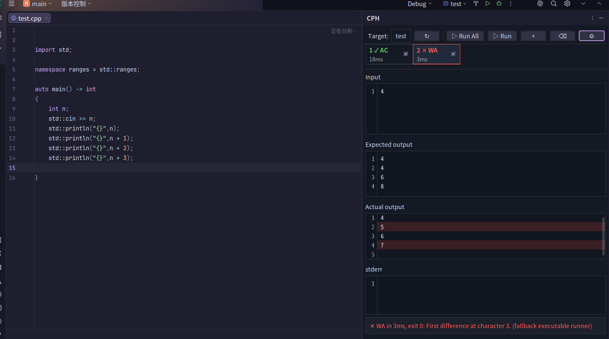

# CPH Target Runner

CPH Target Runner is a CLion plugin for competitive programming sample testing.

It adds a dedicated `CPH` tool window that lets you:

- manage multiple sample cases for the current CMake target or C/C++ file run configuration
- run the selected case or all enabled cases
- compare expected and actual output with configurable whitespace handling
- highlight mismatched lines in actual output
- set per-target time limits
- import problems and samples from Competitive Companion
- configure compile options and CPH-priority run/debug shortcuts

## Demo



## Build

```bash
./gradlew buildPlugin
```

The plugin ZIP is generated at:

```text
build/distributions/clion-cph-target-runner-1.0.4.zip
```

## Install locally

In CLion:

1. Open `Settings`
2. Go to `Plugins`
3. Click the gear icon
4. Choose `Install Plugin from Disk...`
5. Select the ZIP from `build/distributions/`

## Development

Run tests with:

```bash
./gradlew test
```

## License

MIT
